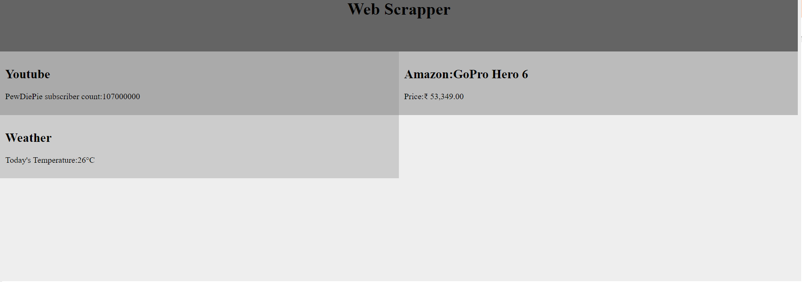

# Simple Web Scrapper tool
This is a simple web scrapping tool which extract details like Price 
of a product, current temperature, youtube subscriber count etc.
It gets the data from internet then shows the data on our html web page!

 
To get your user agent just type "my user agent" in your browser
